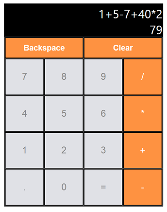

# React Calculator App

## Description

The React Calculator App is a simple web application that allows users to perform basic arithmetic calculations in a user-friendly interface. This project was built using React, a popular JavaScript library for building user interfaces, making it fast, efficient, and interactive.




## Demo 

You can check out the live demo of the React Calculator App:

[weather-app-video.webm](https://github.com/juhikumarimodi6/React-Calculaor/assets/71226446/88d1f8cf-bb4a-4cf2-9979-f08ba1e8971f)


## Features

- Addition, subtraction, multiplication, and division operations
- Clear button to reset the calculator
- Backspace functionality to delete the last input
- Responsive design, suitable for various screen sizes
- Keyboard support for improved accessibility and user experience


## Installation

To run the React Calculator App locally on your machine, follow these steps:

1. Ensure you have Node.js and npm (Node Package Manager) installed on your computer.
2. Clone this repository to your local machine using the following command:

```bash
git clone https://github.com/juhikumarimodi6/React-Calculaor.git
```

3. Navigate to the project directory:

```bash
cd react-calculator-app
```

4. Install the necessary dependencies:

```bash
npm install
```

5. Start the development server:

```bash
npm start
```

6. Open your web browser and visit http://localhost:3000 to access the React Calculator App.

## Usage

Using the React Calculator App is straightforward:

1. Click on the buttons with the respective numbers and operators to input your calculation.
2. The calculator will display the current expression and result in the input field.
3. To perform calculations, click on the "=" button.
4. To clear the current expression, click on the "Clear" button.
5. To delete the last input, click on the "Backspace" button.

## Technologies Used

The React Calculator App is primarily built using the following technologies:

- React: A JavaScript library for building user interfaces.
- HTML: The markup language for structuring the app.
- CSS: Used for styling and layout.
- JavaScript: The programming language for app logic and interactivity.

## Contributing

If you would like to contribute to the React Calculator App, follow these steps:

1. Fork this repository to your GitHub account.
2. Create a new branch with a descriptive name for your feature or bug fix.
3. Make your changes and commit them with clear commit messages.
4. Push your branch to your forked repository.
5. Submit a pull request to the main repository, detailing your changes.

Please ensure your code follows the project's coding standards and includes appropriate tests for new features.

## Contact

Feel free to reach out to me by email at juhikumarimodi6@gmail.com if you have any questions, suggestions, or feedback.

---


